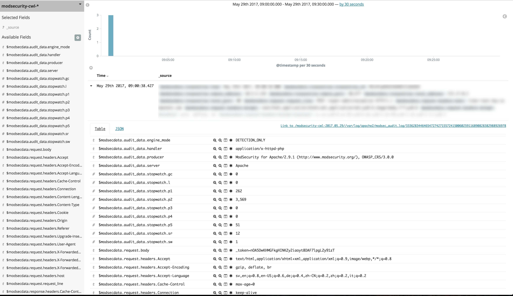

## AWS Lambda Mod Security to ElasticSearch

This lambda function is used on a cloudwatch log stream with mod security log data to add mod security data to ElasticSearch.



The lambda function is based on code generated by AWS when you choose to stream to elasticsearch from cloudwatch logs in the AWS console.


### Requirements
The output from ModSecurity should be json. This requires ModSecurity >= 2.9.1 and set SecAuditLogFormat JSON.
Use the cloudwatch log agent to add data to cloudwatch logs service.

### Installation
Download and install, according to their respective instructions, the following applications:
ModSecurity (https://modsecurity.org/download.html)
Apache2

Then load the module into apache, through `a2enmod security2` or in which ever manner you prefer.

### OWASP
[OWASP](https://www.owasp.org/index.php/Main_Page) is a rule set for ModSecurity, which sets a decent baseline
that you can work out your setup from. This will require tweaking to suit your needs.

When using these the first time around, make sure your ModSecuritys SecRuleEngine config parameter is set to 
**DetectionOnly** or it will break your website sooner or later.

#### Known issues
##### PCRE_LIMITS_EXCEEDED
Error or warning messages with *PCRE_LIMITS_EXCEEDED* is probably due to SecPcreMatchLimit or 
SecPcreMatchLimitRecursion being to low or rules taking on too much.

##### AWS ELB HealthChecks
AWS ELB HealthChecks using HTTP also sends the host header with IP instead of host, this is in violation with 
the RFC and makes [OWASP](https://www.owasp.org/index.php/Main_Page) default configuration trigger a warning.

One way to solve this would be adding the following to your VirtualHost, but might not be prudent if 
this would be an attack-vector on your website.
```	
<LocationMatch /healthcheck/location>
	<IfModule mod_security2.c>
		SecRuleRemoveByMsg "Host header is a numeric IP address"
	</IfModule>
</LocationMatch>
```

##### .deb packages
The version of ModSecurity currently in ubuntu/debian is unfortunately version 2.9.0 and does not support the JSON log format.

### Deployment
Make sure to add correct arguments to Make or modify Makefile
make deploy

Go to the log group and add the created lambda as subscriber. Choose custom logformat and add filter '[modsecdata]'
